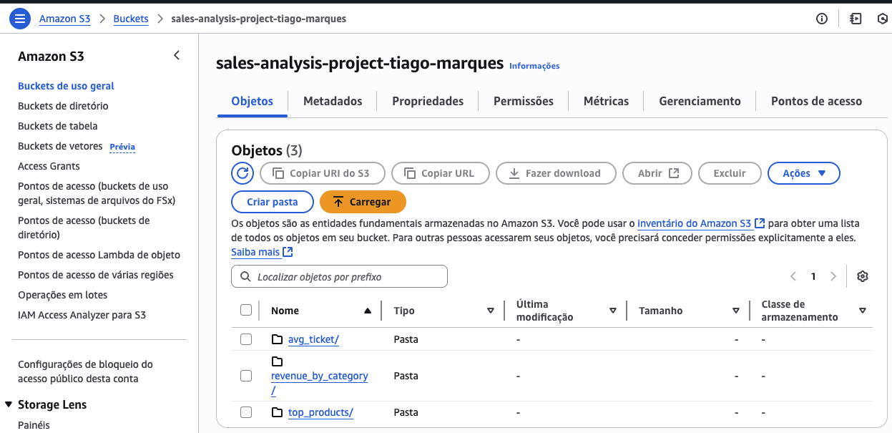
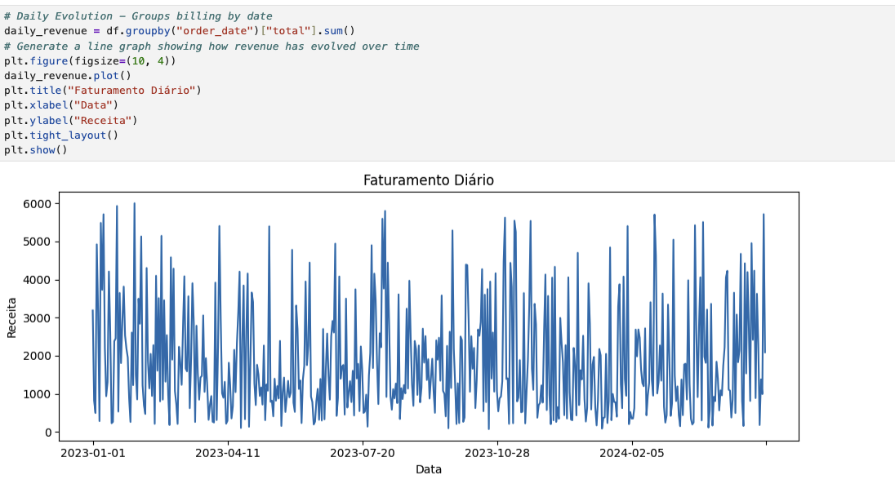

# 🧾 Sales Analysis with PySpark + AWS S3

A sales analysis project using **PySpark locally** with integration to **AWS S3**.  
Simulates a real-world data pipeline with stages for **exploration, transformation**, and **cloud storage**.

---

## 🔧 Prerequisites

- Python 3.11+
- Java 8+
- AWS account with valid credentials

---

## 🔄 Architecture

📦 Local CSVs → 🔍 Exploratory analysis (Pandas) → ⚙️ ETL with PySpark → ☁️ AWS S3

---

## ⚙️ Technologies Used

- Python (Pandas, Matplotlib)
- PySpark
- AWS S3 (via S3A connector)
- virtualenv
- dotenv

---

## 📁 Project Structure

```
sales-analysis/
├── data/               # Input/output CSV and Parquet files
├── scripts/            # exploratory.ipynb and etl.py scripts
├── .env.example        # Environment variable template for AWS
├── requirements.txt    # Project dependencies
├── .gitignore
└── README.md
```

---

## 🚀 How to Run Locally

```bash
git clone https://github.com/yourusername/sales-analysis.git
cd sales-analysis

# Create and activate virtual environment
python3 -m venv venv
source venv/bin/activate

# Install dependencies
pip install -r requirements.txt

# Set up AWS credentials
cp .env.example .env

# Edit the .env file with your actual AWS credentials or comment out the AWS_ACCESS_KEY and SECRET_ACCESS lines, so the file will be generated in the local /output/processed directory

# Optional: export credentials directly in the terminal 
export AWS_ACCESS_KEY_ID=xxxx
export AWS_SECRET_ACCESS_KEY=xxxx

# Run the ETL pipeline
spark-submit   --packages org.apache.hadoop:hadoop-aws:3.3.2   scripts/etl.py
```

---

# Viewing the Results Locally or AWS
If you saved the output locally (default folder: output/processed), run the following command to display the data using PySpark:

    python scripts/view_output.py --path output/processed/revenue_by_category
    
If yoy save the output on AWS S3:

    spark-submit --packages org.apache.hadoop:hadoop-aws:3.3.2 scripts/view_output.py --path s3a://your-bucket/output/revenue_by_category


## 📊 Exploratory Analysis

Open `notebooks/exploratory.ipynb` in VSCode (or Jupyter Lab) and run the cells interactively.

---

## ✅ Output


Here is an example of the final output stored in S3:



And one of the visualizations from the exploratory analysis:


